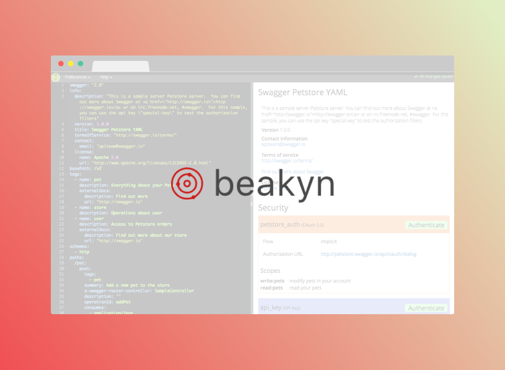

<h1 align="center">
	
	<br>
	<br>
</h1>

<br>
<br>

<p align="center">
  Serves Swagger Editor over local spec files and updates on every change.
<br>
<br>

<a href="https://david-dm.org/Beakyn/bkn-specs-editor" title="dependencies status">
	
</a>

<a href="https://david-dm.org/Beakyn/bkn-specs-editor?type=dev" title="devDependencies status">
	
</a>

<a href="LICENSE.md">
    
</a>

</p>
<br>

---

## Table of Contents

<!-- DO NOT EDIT THE COMMENTS BELOW -->

<!-- toc -->

- [Usage](#usage)
  * [Basic](#basic)
    + [Working on the Specification](#working-on-the-specification)
    + [Adding to an Existing Project](#adding-to-an-existing-project)
  * [Advanced](#advanced)
    + [API](#api)
      - [`liveEditorServer(port)`](#liveeditorserverport)
    + [CLI](#cli)
      - [`$ bkn-specs-editor serve --port`](#-bkn-specs-editor-serve---port)
      - [`$ bkn-specs-editor bundle --destinationPath`](#-bkn-specs-editor-bundle---destinationpath)
- [License](#license)

<!-- tocstop -->

## Usage

### Basic

#### Working on the Specification

> These are the basic steps when working with a repo that uses [bkn-specs-editor](https://github.com/Beakyn/bkn-specs-editor) inside `devDependencies`.

1. Go the project repository of which the spec you'd like to work on–e.g. `Beakyn/gsp-geofence-api`.

1. Run the specs editing script–usually `npm run docs:specs:edit`.

1. A new tab on your browser will open running an instance of the [Swagger Editor](https://swagger.io/swagger-editor/).

1. Write everything you need. All changes are immediately propagated through the `spec/` directory.

1. Once you finish with the changes you can run the bundling script using: `npm run docs:specs:build`.

1. Share you changes with the rest of the world by pushing to the `master` branch on GitHub.

#### Adding to an Existing Project

> These are the basic steps when adding [bkn-specs-editor](https://github.com/Beakyn/bkn-specs-editor)
to an existing API project documentation workflow.

1. Add it inside `devDependencies`:

    ```sh
    # Using npm
    npm install --save-dev bkn-specs-editor

    # Using yarn
    yarn add --dev bkn-specs-editor
    ```

1. Ensure you have the following structure in your project:

    ```sh
    |-- spec/
    |   |-- definitions/
    |   |-- paths/
    |   |-- swagger.yml
    |-- package.json
    |-- ...
    ```

1. Add a specs editing script–standarized as `npm run docs:specs:edit` in your `package.json`:

    ```json
    {
      "name": "gsp-geofence-api",
      ...
      "scripts": {
        ...
        "docs:specs:edit": "bkn-specs-editor serve"
      }
      ...
    }
    ```

1. Add a bundling script–standarized as `npm run docs:specs:build` in your `package.json`:

    ```json
    {
      "name": "gsp-geofence-api",
      ...
      "scripts": {
        ...
        "docs:specs:edit": "bkn-specs-editor serve",
        "docs:specs:build": "bkn-specs-editor bundle"
      },
      ...
    }
    ```

1. You can now start [working on the specification](#working-on-the-specification).

### Advanced

#### API

```sh
# Using npm
npm install bkn-specs-editor

# Using yarn
yarn add bkn-specs-editor
```

##### `liveEditorServer(port)`

**Receives**:

- `port`: `number`

> An available port to start listening on (defaults to `3001`).

**Does**: Enables live editing of the Swagger API file on the selected port.

#### CLI

```sh
# Using npm
npm install -g bkn-specs-editor

# Using yarn
yarn add global bkn-specs-editor
```

##### `$ bkn-specs-editor serve --port`

**Receives**:

- `port`: `number`

> An available port to start listening on (defaults to `3001`).

**Does**: Enables live editing of the Swagger API file on the selected port.

##### `$ bkn-specs-editor bundle --destinationPath`

**Receives**:

- `destinationPath`: `string`

> The output file path (defaults to 'spec/index.yaml').

**Does**: Bundles the multi-file Swagger spec into one.

## License

This project is licensed under the terms of the
[MIT license](https://github.com/Beakyn/bkn-ui-react/blob/master/LICENSE)
